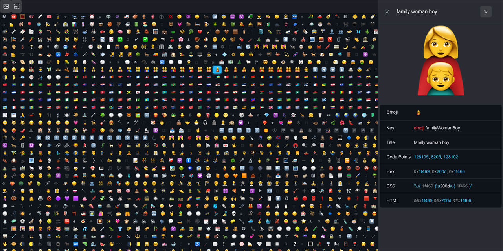

# emoji-ui

A small demo app that lets you search for various emoji available from the npm package `@lewismoten/emoji`

# Development

Just run `npm start`. The script will build the code, start up a local webserver, and display the site in your browser.

# Demo

Everything needed to setup as a static website can be found in the `dist` folder, starting with `index.html`.

An interactive demonstration of the `dist` folder is also hosted on GitHub pages.

<https://lewismoten.github.co/emoji-ui/>
